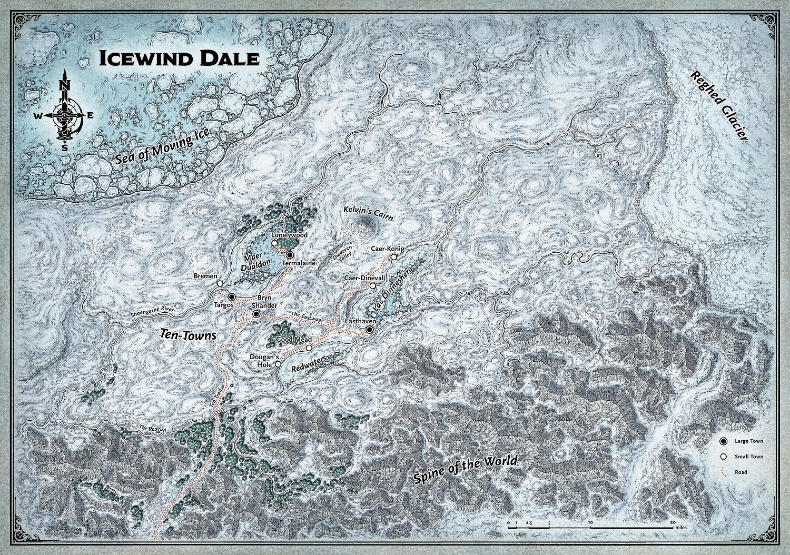

Campaign
========

.. toctree::
   :maxdepth: 2
   :caption: Contents:

Overview
--------
The campaign will run from level 3-5 over ~16 sessions. The party will be part of a caravan headed
to Bryn Shander - the largest town in Icewind Dale. There you'll encounter a number of story
threads, and it will be up to you which threads you choose to follow. Your goal will be to help the
people of Icewind Dale, so make a character motivated to do that.

You might want to incorporate one of the following themes of the campaign into your character's
background:

- Reghed barbarians, who live a nomadic life in the tundra
- Battlehammer Dwarves, in the Dwarven Valley
- The Harpers, a network of do-good spies
- The Arcane Brotherhood, a notorious company of wizards

Icewind Dale
------------

*Freezing wind sweeps across the tundra, ceaselessly battering anything that dares to grow or breathe in its
domain. Even in summer, when the days stretch interminably long, the sun blazing low in the midnight sky
brings no respite from the chill. Without fail, the wind finds its way through every chink and crack, every
opening in the warmest furs, every tent flap, every roof and board ofthe strongest homes.
It drains away any hint of warmth wherever it finds purchase.*

*The threat of winter's fury is never far away.
The wind sweeping down from the Reghed Glacier howls its wrath and sometimes carries stinging sprays
ofice in its grasp. The sun never rises far above the horizon
even at the height of summer — and the height of summer is fleeting. During the rest of the year
sudden storms bring driving hail or sleet that leaves everything coated in a sheath ofice, or they
bring snow that piles in deep drifts.*

*All this cold and fury is caged into one small region.
The ice cliffs of the Reghed Glacier — the source ofthe never-ending wind — rises up in the east like
prison walls, home to white dragons and enormous remorhazes. In the south loom the snow-capped peaks of
the Spine ofthe World, crawling with orcs, goblins, and other monsters.
North and west, the Sea of Moving Ice churns bergs and floes
in an endless tumult, like winter grinding its teeth in anticipation of its next freezing assault.*

*And yet, such is the nature of life that even in this hostile place, it manages to lift its head in
defiance ofthe biting cold. Lichens cling to weathered rock despite the battering ofthe winds,
providing sustenance to herds of reindeer through the winter. Fish swim in the lakes and rivers that dot the tundra.*

*When summer comes to the tundra, life shakes off the torpor of winter and comes forth in full flower.
Grasses grow two or three feet high in the span ofweeks. Birds flock to the marshes formed in the thawing soil.
Reindeer calves fill out the herds that have been diminished through the winter.*

*Of course, no region ofthe Forgotten Realms is without its people. Human tribes follow the reindeer
herds through their annual migrations. Other humans dare the treacherous waters ofthe Sea of
Moving Ice in search offish, seals, and whales to sus tam them. Dwarves dig into the earth to find
shelter from the biting wind, mining for iron and forging weapons and armor.*

*Most improbably of all, civilized folk descended from foolhardy and treasure-mad immigrants from
the south manage to survive and sometimes thrive in ten small towns. The wooden buildings of these
towns provide only a little shelter from the cold and wind, and no protection at all from the attacks of orcs, barbarians, or the fierce tundra yeti.
Though the towns are clustered around three icy lakes teeming with knucklehead trout, resources are scarce,
and competition between neighboring communi ties can be fierce and occasionally deadly.
But for all the dangers, people still live in the region known as Ten-Towns, and new arrivals—outcasts, fugitives,
wanderers, and adventurers—still come to test them- selves against the harshest environment known to
the world.*

*This is Icewind Dale.*

Ten-Towns
---------
.. image:: ../images/ten-towns-map.webp
  :width: 1200
  :alt: Ten-Towns

*Who would choose to settle in a frontier land as brutal as Icewind Dale? The answers are as diverse
as the people of Ten-Towns, who are a cross-section of the whole of the Forgotten Realms.*

*Some people come to Ten-Towns determined to make their fortunes.
Although demand for knuckle-head scrimshaw in southern lands is not what it once
was, there is still money to be made in fishing for the trout and selling or carving their ivory-like bones.
The valley and the slopes of the Spine ofthe World are rich in mineral resources, as are the gem
mines near Termalaine, so a few hopeful prospectors make their way to the far north in hopes of
striking a rich new vein.*

*Still others come for the solitude.
It is hard to get much farther away from the hustle and press of civilization than Icewind Dale —
or closer to a particularly stark, harsh form of nature's beauty. The dale is also a fine place to
escape notice and stay out ofthe reach ofthe law ofthe southern cities.
Like the famous drow Drizzt Do'Urden, many ofthe people who come to Icewind Dale are outcasts,
fugitives, or pariahs in search ofa place where they can be tolerated, if not accepted.*

*Some ofthe people of Ten-Towns are descended from the Reghed barbarians who settled in Caer-Konig
and Bremen for a time. They abandoned their ancient traditions and self-sufficient lifestyle after
they were decimated by the armies of Akar Kessell a hundred years ago. Many of their kin still roam
the tundra, but Caer-Konig and Bremen in particular have significant populations ofexceptionally
tall men and women descended from the Reghed tribes.*

*Of course, now—four hundred years after the Dinev family first settled on the shores of
Lac Diimeshere — most ofthe people ofTen-Towns are here because they were born here, grew up here,
and never really considered leaving.
They're accustomed to the cold, and they smile behind their hands at — or openly mock — the weak
southern folk who visit their homeland and complain about the weather.
Like the hardy lichens and determined reindeer ofthe tundra, residents make a living under the
shadow of Kelvin's Cairn, hunker down to endure the brutal winters, and bring a zesty lust for life
to the summers, enjoying what respite they can from the bitter cold.*

*Life in Ten-Towns is hard work. The people know the value of cooperation, and neighbors within a
town depend on each other every day for survival.
A pair of strong hands is too valuable a resource to waste, so when criminals are caught and
brought to justice, they're not locked up — they're put to work for the common good.*

*The friendliness that suffuses each town often stops at the edge ofthat community.
The people of other towns aren't neighbors; they're competitors for resources.*
