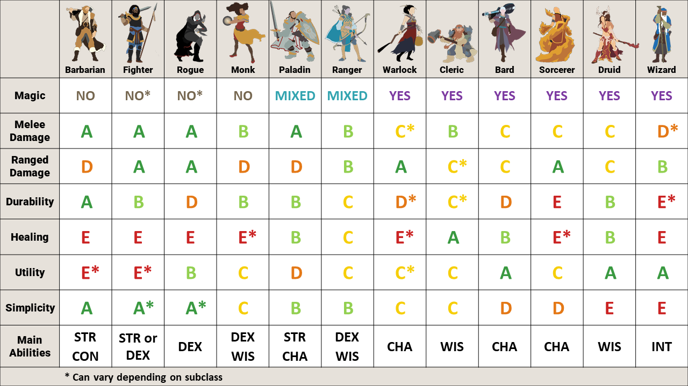

Character Creation
==================

.. toctree::
   :maxdepth: 2
   :caption: Contents:

The adventure will take place around Good Mead - a small town in Icewind Dale which produces mead from honey. Rumour has it some townsfolk have been murdered there recently.

It'll be a pretty short adventure without much opportunity for personalised hooks, so create a level 5 character that has a reason to be in Good Mead and is motivated to help the people there.

Golden Rules
------------
1. Create a character that wants to be an adventurer.
2. Create a character that will be fun for the rest of the party to adventure with.
3. Pitch your character idea(s) to me early.

Setting-inspired characters
---------------------------
Typically players start a character idea with a class, and let the rest of the details fit around that.
I think that leads to bland characters, eg. Wizardo the wizard who has always been a wizard and does wizardry for a living.

Instead, I'd recommend starting with something you know about the setting of the campaign and try to build an idea from that.
By imposing this soft-constraint on yourself, you'll likely come up with a more unique character idea,
and it'll have a backstory rooted in the campaign setting - which gives the DM more options for
personalising content.

For example, let's start with:

*I grew up in Termalaine working in the gem mine. One day a loved one died in a terrible accident, which set me on my path of adventuring.*

This gives us:

- A location in the setting to build around
- A theme to work with (mining, gems)
- A motivation generic enough it can be adapted to the class and campaign

With this seed, we might come up with the following ideas for each class:

- Artificer (Armourer). Used power suit with thunder gauntlets in mine, now repurposed for combat.
- Bard. Collecting stories of tragedy to write an epic ballad.
- Barbarian. Worked as a labourer in the mines. Has learned to channel anger thinking about the accident into rage ability.
- Cleric. Loved one could have been saved with appropriate medical care. Now devoted to being a healer.
- Fighter (Rune Knight). Worked as a smith smelting the ore from the mine. Loved one discovered a cavern filled with giant runes marked on the walls prior to death. Have been learning how to apply these runes to weapons in memory of loved one.
- Monk. After the accident spent 5 years in monastery. Now returning home for the first time, ready to make a difference.
- Paladin. Swore an oath after accident. Eg. To prevent humans mining and destroying nature (ancients), or revenge against a responsible organisation (vengeance).
- Ranger (Gloomstalker). Was patrol leader in mining explorations. Experienced in all things Underdark.
- Rogue (Mastermind). Used to sell insider information about where to mine. Was discovered and had to leave town and change identity.
- Sorcerer. Reflavour one of the draconic ancestries to be gem dragon. Or one day you touched a crystal you found and woke up with powers.
- Warlock (Genie). Found a genie in a bottle underground, made a pact with it to gain magical powers.
- Wizard (Transmutation). Study of materials with magical properties.

Here's another example:

*I've sailed the Sea of Moving Ice to hunt whales. I realised my life expectancy wasn't great at sea,
so I made a new life for myself in Icewind Dale. Whaling turned me into an adrenaline-junkie, so
so I've gravitated towards the life of an adventurer.*

- Artificer (Alchemist). Served as doctor onboard, can make all sorts of potions in a pinch.
- Barbarian (Storm Herald). Sailing these rough seas has given you a unshakeable respect for nature's wrath,
  which has manifested as minor magical powers. You feel like you've mastered the sea, and now it's
  time to master the tundra.
- Cleric (Tempest). Like many sailors you worship Umberlee the Bitch Queen, goddess of the seas. You
  had a dream one night and woke with a new purpose that sent you to Ten-Towns.
- Druid (Stars). The stars have always spoken to you. Your mastery of constellations has made you a
  talented navigator, and throughout your journeys at sea and dialogue with nature you've developed
  magical powers. Recent guidance from the stars had led you to Ten-Towns.
- Fighter (Battle Master). Combat with pirates on ship decks at rough seas builds a repertoire of
  dirty tricks and manoeuvres to get the upper hand. Fighting on land seems easy by comparison, and
  people pay good money for your skills.
- Monk (Drunken Master). Same as fighter.
- Paladin (Open Sea, Ancients). Similar to barbarian.
- Ranger (Hunter). You have a wealth of experience hunting monsters many times your size. Luckily
  Icewind Dale is full of monsters, and people willing to pay for your services.
- Rogue (Swashbuckler). Same as fighter.
- Sorcerer (Storm). One day you fell overboard, and were rescued under circumstances you don't remember.
  After you woke from your coma weeks later, you gradually discovered your new powers.
- Warlock (Depths). You feared you wouldn't survive a terrible storm, and in your desperation you
  made all sorts of promises to yourself about what you'd do if you survived. You did survive, and
  have new-found powers. *What* did you promise again? *Who* did you make the promises to?
- Wizard (Divination). You've always had a knack for reading the tea-leaves, charting a course and
  finding the best fishing spots.

If you'd decided to play Wizardo the wizard first, it's unlikely the gem mine in Termalaine nor
the Sea of Moving Ice would jump out at you as something to incorporate into your backstory. If instead you
soft-commit to something that interests you, you'll come up with better ideas!

Ability Scores
--------------
Once you have a rough idea for a backstory, you'll roll for stats. You'll generate an array like
``STR 12, DEX 13, CON 12, WIS 16, INT 7, CHA 14``, and can then swap the position of any two stats.

Each score is bounded to ``[7, 16]``, and the total will always be 74. This way everyone will get
similar stats, and no one will be significantly stronger than anyone else.

Playable Races
--------------
- Aasimar
- Bugbear
- Custom Lineage
- Dragonborn
- Duergar
- Dwarf
- Eladrin
- Elf
- Firbolg
- Genasi
- Gnome
- Goblin
- Goliath
- Gothic Lineage (Dhampir, Hexblood, Reborn)
- Half-elf
- Half-orc
- Halfling
- Hobgoblin
- Human
- Kobold
- Lizardfolk
- Orc
- Tiefling
- Triton
- Yuan-ti

Use the Monsters of the Multiverse version of a race if available.
Let me know if there's something else you really want to play.

Complexity
----------
Play something with an appropriate level of complexity. If you play a spellcaster you'll need to
spend some time learning what your spells do, and I'd recommend using a tablet to let you look
things up quickly as dndbeyond on mobile is a bit clunky.

Multiclassing
-------------
Sure, but note it's probably a bad idea at level 5.

Backgrounds
-----------
Custom backgrounds are fine.
`This <https://www.reddit.com/r/dndnext/comments/bw2kl7/character_concepts_for_every_classbackground?sort=confidence>`_
is a useful matrix of class/background combinations you might use as inspiration.

Don't pick backgrounds for their mechanical benefits,
I'll tend to ignore the mechanical parts anyway as some are stupidly strong (eg. Outlander).
Instead I'll just play-it-by-ear give in-game benefits where your background is relevant, eg.
*"Go ahead and roll medicine with advantage to determine how this person died, given your gladiator
background."*

This way everyone should feel free to pick whatever interests them, without worrying about what's optimal.
The best way to get an in-game benefit is to have a backstory with ties to the setting.

Innate Spellcasting
-------------------
Pre-TcoE if a racial ability or feat let you cast a spell once per long rest, RAW you don't count as knowing that spell and you cannot cast it with any spell slots you may have. Eg. Tiefling Infernal Legacy.

Post-TcoE this changed, allowing you to also cast the spell using any spell slots you may have. Eg. Fey Touched feat.

I would like to interpret all of these abilities in the post-TcoE way, so if you play a Tiefling you may also cast hellish rebuke using any spell slots you have.

Alignment
---------
I don't care about alignment as long as it doesn't conflict with the golden rules.

Bonus points if you read this `hyper nerdy article <https://humanparts.medium.com/the-mtg-color-wheel-c9700a7cf36d>`_
and tell me which colors represent your character's personality.

Sorcerer Spell Points
---------------------
If you play a sorcerer, you may use the variant `rules <http://dnd5e.wikidot.com/spell-points>`_
for spell points. Note this will add a fair bit of complexity, not for the faint-hearted.

Miscellaneous
-------------
- I'm generally happy to reskin things, eg. use half-orc mechanics to play a human barbarian.
- All the optional stuff from TcoE is fine.
- Content from Eberron and Critical Role is in general not allowed, let me know if there's something you really want.
- Don't play something that will slow combat down, eg. micromanaging multiple units like summons.
- Don't play something that has lots of crazy random effects like rolling on d100 tables, eg. wild magic sorcerer.